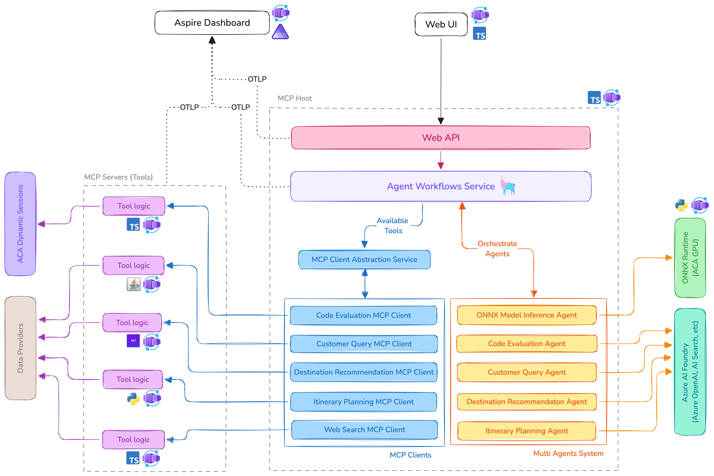

# The AI Travel Agents

The AI Travel Agents is a robust **enterprise application** that leverages multiple **AI agents** to enhance travel agency operations. The application demonstrates how **six AI agents** collaborate to assist employees in handling customer queries, providing destination recommendations, and planning itineraries.

## Overview of AI Agents

| Agent Name                       | Purpose                                                                                                                       |
| -------------------------------- | ----------------------------------------------------------------------------------------------------------------------------- |
| **Customer Query Understanding** | Extracts key **preferences** from customer inquiries.                                                                         |
| **Destination Recommendation**   | Suggests destinations based on customer preferences.                                                                          |
| **Itinerary Planning**           | Creates a detailed itinerary and travel plan.                                                                                 |
| **Code Evaluation**              | Executes custom logic and scripts if needed.                                                                                  |
| **Model Inference**              | Runs a custom **LLM** using **ONNX** and **vLLM** on **Azure Container Apps' serverless GPU** for high-performance inference. |
| **Echo Ping**                    | Echoes back any received input (used as an MCP server example).                                                               |
| **Web Search**                   | Uses Grounding with Bing Search to fetch live travel data.                                                                    |

## High-Level Architecture

The architecture of the AI Travel Agents application is designed to be modular and scalable:

- All components are containerized using **Docker** so that they can be easily deployed and managed by **[Azure Container Apps](https://learn.microsoft.com/azure/container-apps/)**.
- All agents tools are available as MCP ([Model Context Protocol](https://github.com/modelcontextprotocol)) servers and are called by the MCP clients.
- MCP servers are implemented independently using variant technologies, such as **Python**, **Node.js**, **Java**, and **.NET**.
- The Agent Workflow Service orchestrates the interaction between the agents and MCP clients, allowing them to work together seamlessly.
- The Aspire Dashboard is used to monitor the application, providing insights into the performance and behavior of the agents (through the [OpenTelemetry integration](https://opentelemetry.io/ecosystem/integrations/)).



## Project Structure

```
ai-travel-agents/
│── src/
│   ├── tools/
│   │   ├── customer-query/
│   │   ├── destination-recommendation/
│   │   ├── itinerary-planning/
│   │   ├── code-evaluation/
│   │   ├── model-inference/
│   │   ├── web-search/
│   │   └── echo-ping/
│   │
│   ├── api/                # API Gateway for backend services
│   └── ui/                 # Frontend application
│
│── infra/                  # azd and IaC related files
│── docs/                   # Documentation files
│
│── README.md              # Project documentation
```

## Prerequisites

Ensure you have the following installed before running the application:

- **[Docker](https://www.docker.com/)**
- **[Foundry Local](https://github.com/microsoft/Foundry-Local)** (works on Windows and macOS only)
- **[Node.js](https://nodejs.org/en/download)** (for the UI and API services)

To speed up the local development experience during the initial setup, you can use the **Foundry Local** CLI to download and cache the model used in the application (default is `phi-3.5-mini`). This will allow you to run the application locally without needing to download the models at runtime.

```bash
foundry model download phi-3.5-mini
```


## Try the demo locally (Local Agent Experience) with Foundry Local

To run the application locally, make sure you have **Docker**, **Node.js** and **Foundry Local** installed. The application is designed to run in a containerized environment, so you can easily set up and run the services using Docker.

1. After cloning the repository, navigate to the root directory of the project and start the MCP servers:
```bash
./run-mcp-servers.sh # or run-mcp-servers.ps1 on Windows
```

2. Open a new terminal and run the following command to start the API:
```bash
npm install --prefix=src/api
npm run start --prefix=src/api
```

3. Open a new terminal and run the following command to start the UI:
```bash
npm install --prefix=src/ui
npm run start --prefix=src/ui
```

4. Navigate to the UI in your web browser at `http://localhost:4200`.


> [!IMPORTANT]
> Make sure your computer has a compatible CPU or GPU for running LLM models locally. If you are experiencing issues with the model inference service, please try a different smaller model.

## Advanced Setup

To run the application in a more advanced local setup or deploy to Azure, please refer to the [Advanced Setup](docs/advanced-setup.md) documentation. This includes setting up the Azure Container Apps environment, configuring the services, and deploying the application to Azure.

## Contributing

We welcome contributions to the AI Travel Agents project! If you have suggestions, bug fixes, or new features, please feel free to submit a pull request. For more information on contributing, please refer to the [CONTRIBUTING.md](CONTRIBUTING.md) file.