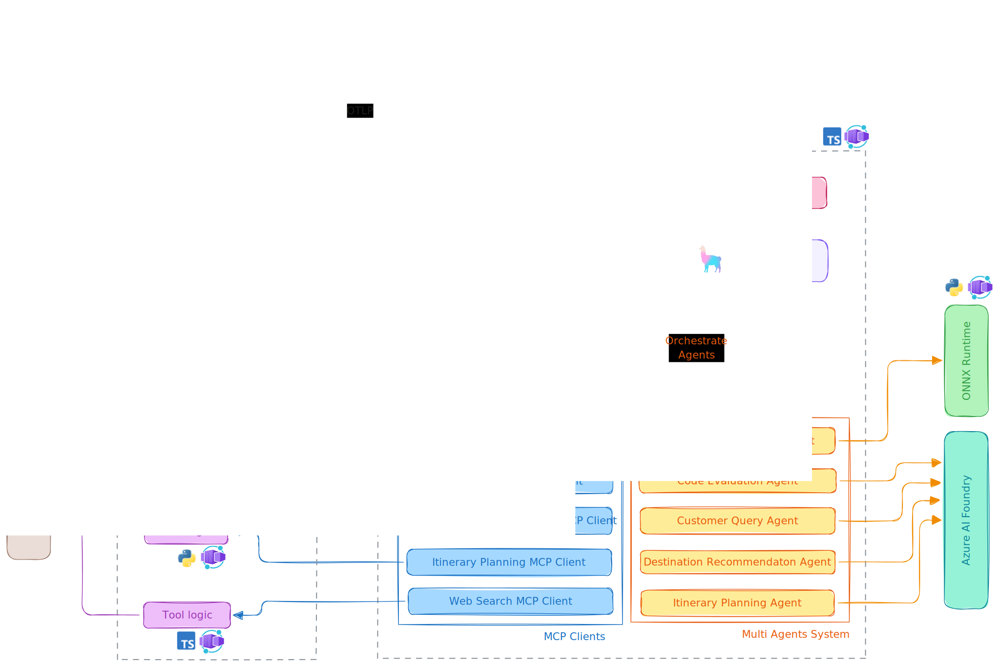

# The AI Travel Agents

The AI Travel Agents is a robust **enterprise application** that leverages multiple **AI agents** to enhance travel agency operations. The application demonstrates how **six AI agents** collaborate to assist employees in handling customer queries, providing destination recommendations, and planning itineraries.

## Overview of AI Agents

| Agent Name                       | Purpose                                                                                                                       |
| -------------------------------- | ----------------------------------------------------------------------------------------------------------------------------- |
| **Customer Query Understanding** | Extracts key **preferences** from customer inquiries.                                                                         |
| **Destination Recommendation**   | Suggests destinations based on customer preferences.                                                                          |
| **Itinerary Planning**           | Creates a detailed itinerary and travel plan.                                                                                 |
| **Code Evaluation**              | Executes custom logic and scripts if needed.                                                                                  |
| **Model Inference**              | Runs a custom **LLM** using **ONNX** and **vLLM** on **Azure Container Apps' serverless GPU** for high-performance inference. |
| **Echo Ping**                    | Echoes back any received input (used as an MCP server example).                                                               |
| **Web Search**                   | Uses Grounding with Bing Search to fetch live travel data.                                                                    |

## High-Level Architecture

The architecture of the AI Travel Agents application is designed to be modular and scalable:

- All components are containerized using **Docker** so that they can be easily deployed and managed by **[Azure Container Apps](https://learn.microsoft.com/azure/container-apps/)**.
- All agents tools are available as MCP ([Model Context Protocol](https://github.com/modelcontextprotocol)) servers and are called by the MCP clients.
- MCP servers are implemented indenpendently using variant technologies, such as **Python**, **Node.js**, **Java**, and **.NET**.
- The Agent Workflow Service orchestrates the interaction between the agents and MCP clients, allowing them to work together seamlessly.
- The Aspire Dashboard is used to monitor the application, providing insights into the performance and behavior of the agents (through the [OpenTelemetry integration](https://opentelemetry.io/ecosystem/integrations/)).



## Project Structure

```
ai-travel-agents/
│── src/
│   ├── tools/
│   │   ├── customer-query/
│   │   ├── destination-recommendation/
│   │   ├── itinerary-planning/
│   │   ├── code-evaluation/
│   │   ├── model-inference/
│   │   ├── web-search/
│   │   └── echo-ping/
│   │
│   ├── api/                # API Gateway for backend services
│   └── ui/                 # Frontend application
│
│── infra/                  # azd-related files
│── docs/                   # Documentation files
│
│── README.md              # Project documentation
```

## Prerequisites

Ensure you have the following installed before running the application:

- **[Docker](https://www.docker.com/)**

## Run the Entire Application

To run the entire application, use the scripts in the root directory. The scripts will build and run all the services defined in the `src/docker-compose.yml` file.

```sh
./run.sh
```

> On Windows, you may need to use `run.ps1` instead of `run.sh`.

Alternatively, if you're in VS Code you can use the **Run Task** command (Ctrl+Shift+P) and select the `Run AI Travel Agents` task.

This command will build and start all the services defined in the `docker-compose.yml` file.

Once all services are up and running, you can view the messages (currently logging messages) via the [Aspire Dashboard](https://aspiredashboard.com/) at http://localhost:18888. On `Structured` tab you'll see the logging messages from the **tool-echo-ping** and **api** services. The `Traces` tab will show the traces across the services, such as the call from **api** to **echo-agent**.
