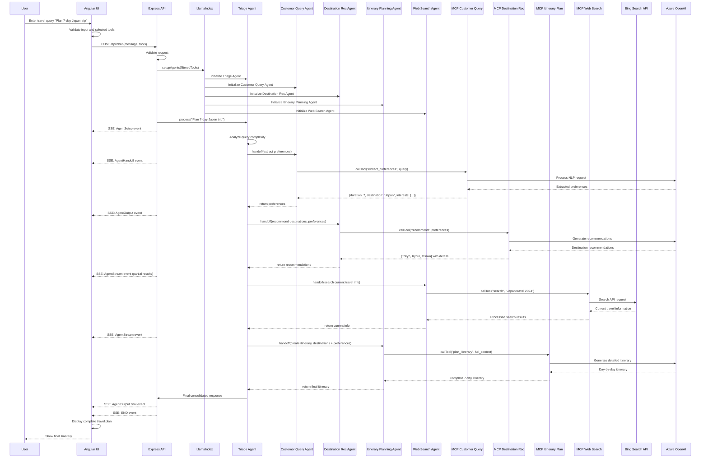
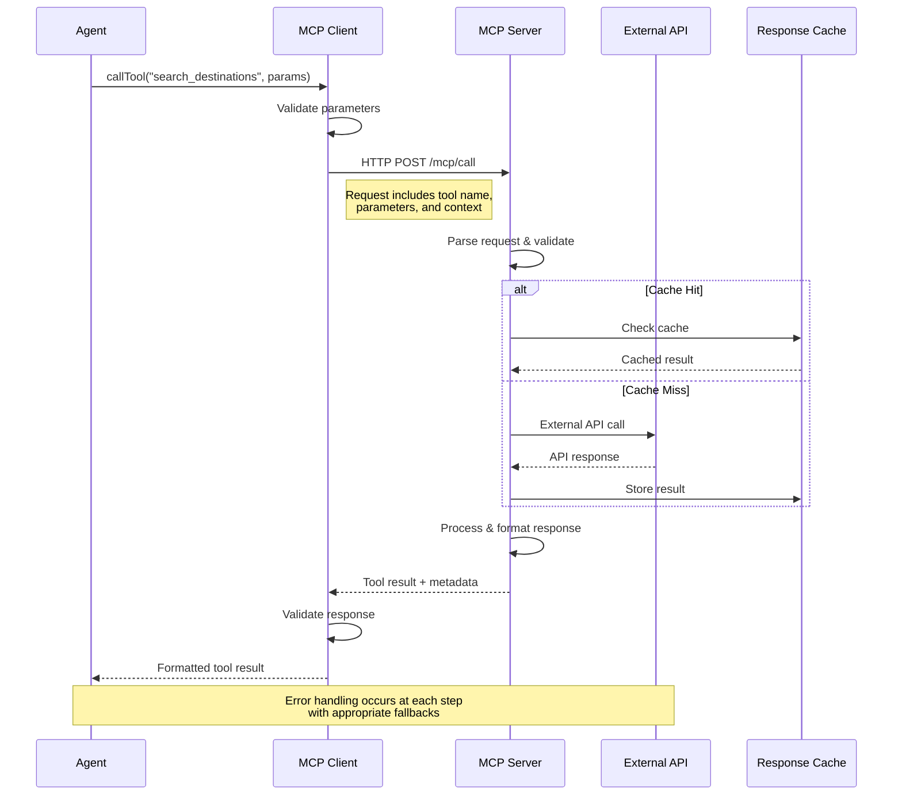
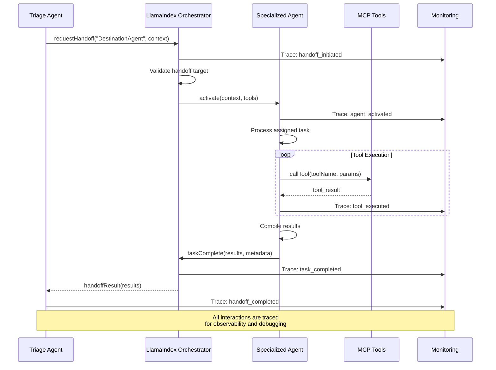
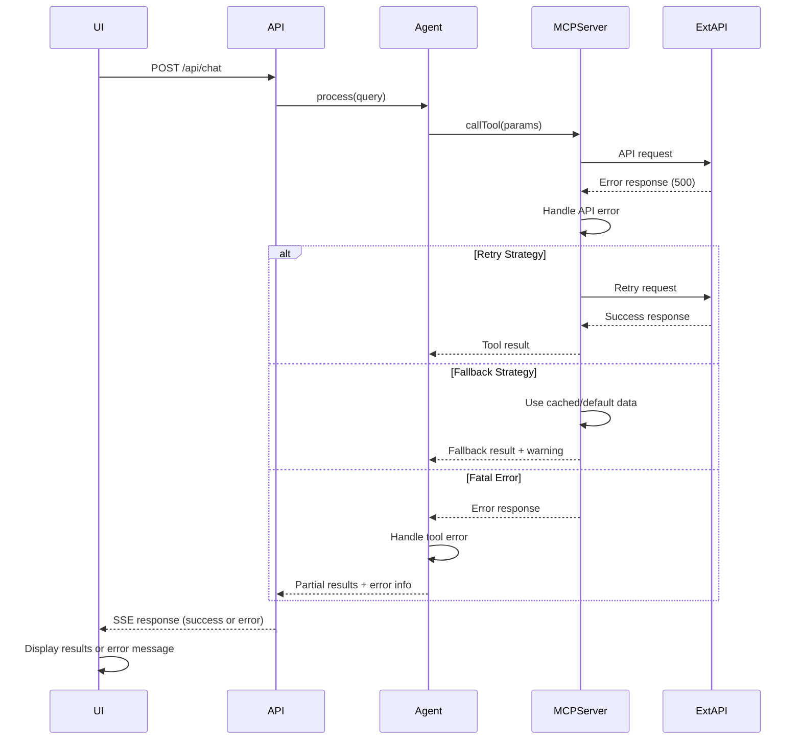
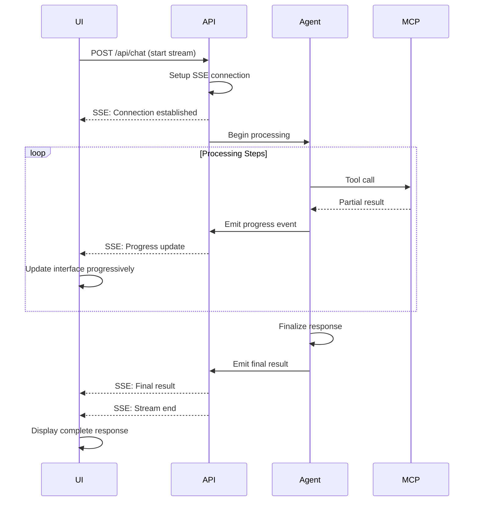
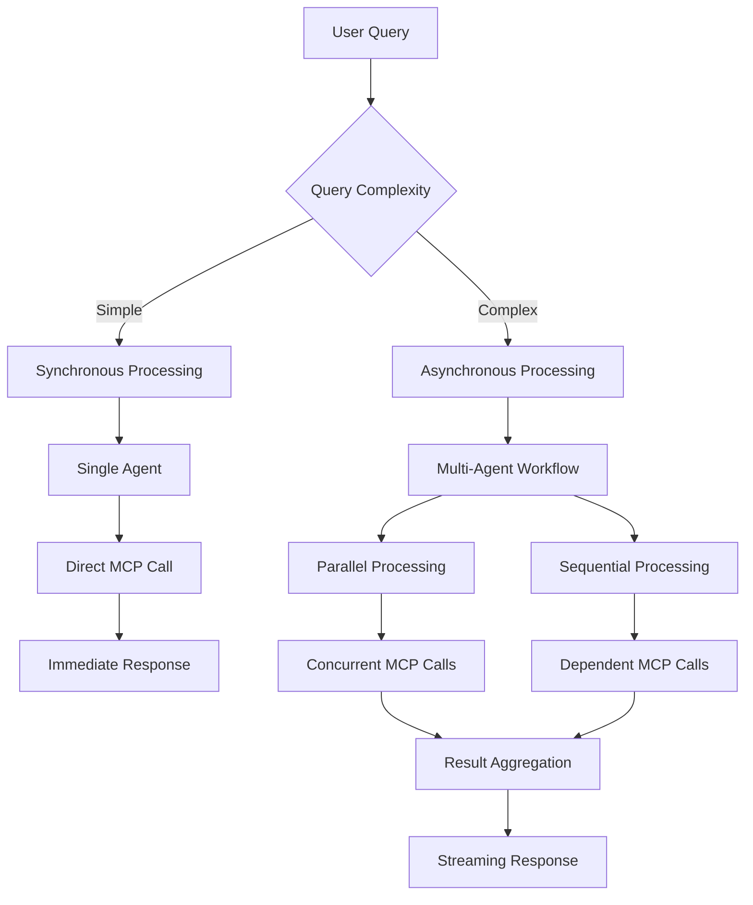
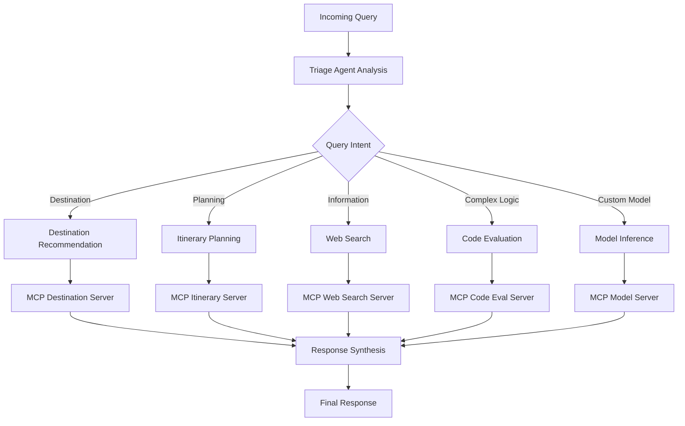
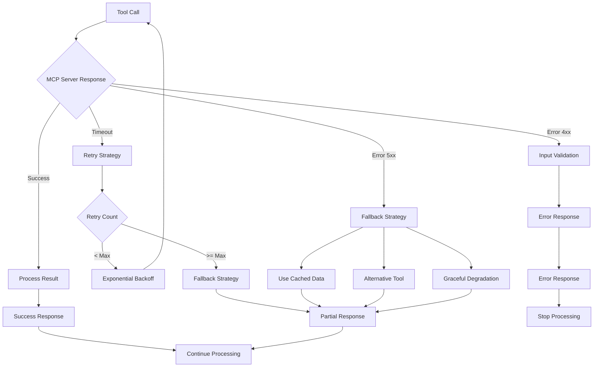
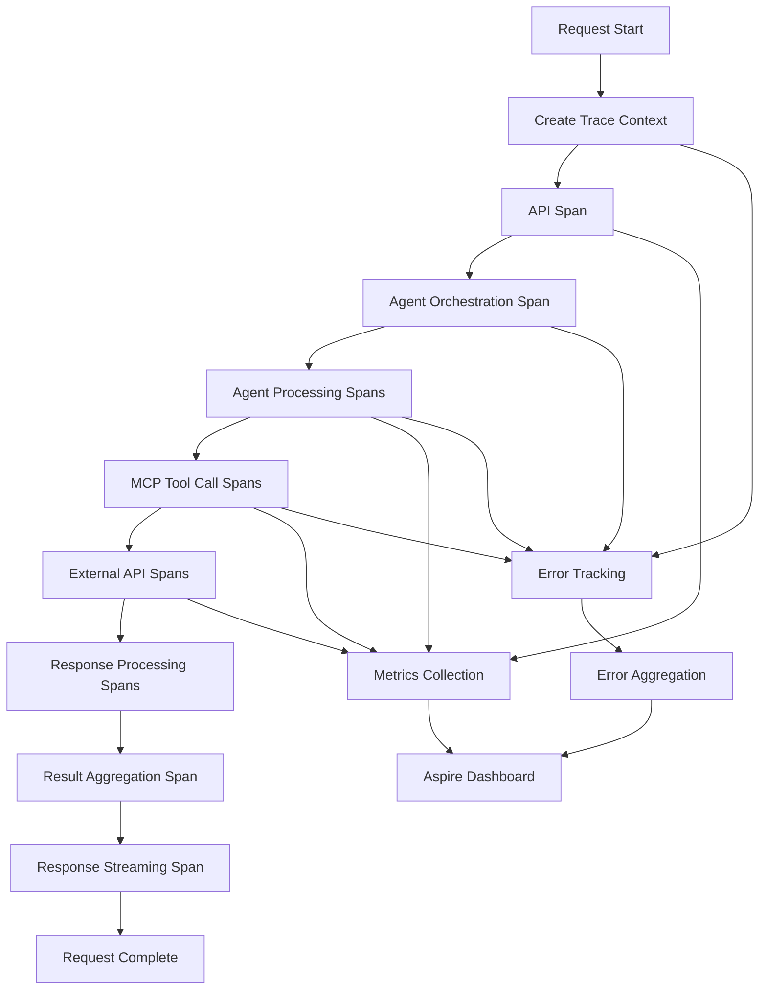

# Data Flow and Sequence Diagrams

This document provides detailed flow diagrams and sequence diagrams to illustrate how requests flow through the Azure AI Travel Agents system, from the UI to the API, and through the AI agent integrations with MCP servers.

## Request Flow Diagrams

### 1. High-Level System Flow

```
┌─────────────┐    ┌─────────────┐    ┌─────────────────┐    ┌─────────────────┐
│   User      │    │ Angular UI  │    │  Express API    │    │ LlamaIndex      │
│             │    │             │    │                 │    │ Orchestrator    │
└─────┬───────┘    └──────┬──────┘    └────────┬────────┘    └────────┬────────┘
      │                   │                    │                      │
      │ 1. Travel Query   │                    │                      │
      ├──────────────────►│                    │                      │
      │                   │ 2. POST /api/chat  │                      │
      │                   ├───────────────────►│                      │
      │                   │                    │ 3. Setup Agents     │
      │                   │                    ├─────────────────────►│
      │                   │                    │                      │
      │                   │ 4. SSE Stream      │ 5. Agent Processing  │
      │ 6. Real-time      │◄───────────────────┤◄─────────────────────┤
      │    Updates        │                    │                      │
      ◄───────────────────┤                    │                      │
      │                   │                    │                      │
```

### 2. MCP Server Integration Flow

```
┌─────────────────┐    ┌─────────────────┐    ┌─────────────────┐    ┌─────────────────┐
│ Specialized     │    │   MCP Client    │    │   MCP Server    │    │ External APIs/  │
│ Agent           │    │                 │    │                 │    │ Services        │
└────────┬────────┘    └────────┬────────┘    └────────┬────────┘    └────────┬────────┘
         │                      │                      │                      │
         │ 1. Tool Call Request │                      │                      │
         ├─────────────────────►│                      │                      │
         │                      │ 2. HTTP/SSE Request  │                      │
         │                      ├─────────────────────►│                      │
         │                      │                      │ 3. External API Call│
         │                      │                      ├─────────────────────►│
         │                      │                      │ 4. API Response      │
         │                      │                      ◄─────────────────────┤
         │                      │ 5. Processed Result  │                      │
         │ 6. Tool Response     ◄─────────────────────┤                      │
         ◄─────────────────────┤                      │                      │
         │                      │                      │                      │
```

### 3. Multi-Agent Collaboration Flow

```
┌─────────────┐    ┌─────────────┐    ┌─────────────┐    ┌─────────────┐
│   Triage    │    │ Customer    │    │Destination  │    │ Itinerary   │
│   Agent     │    │ Query Agent │    │Recommendation│    │ Planning    │
│             │    │             │    │   Agent     │    │   Agent     │
└──────┬──────┘    └──────┬──────┘    └──────┬──────┘    └──────┬──────┘
       │                  │                  │                  │
       │ 1. Analyze Query │                  │                  │
       │                  │                  │                  │
       │ 2. Extract       │                  │                  │
       │    Preferences   │                  │                  │
       ├─────────────────►│                  │                  │
       │ 3. Preferences   │                  │                  │
       ◄─────────────────┤                  │                  │
       │                  │                  │                  │
       │ 4. Get           │                  │                  │
       │    Recommendations                  │                  │
       ├────────────────────────────────────►│                  │
       │ 5. Destinations  │                  │                  │
       ◄────────────────────────────────────┤                  │
       │                  │                  │                  │
       │ 6. Plan Itinerary│                  │                  │
       ├───────────────────────────────────────────────────────►│
       │ 7. Complete Plan │                  │                  │
       ◄───────────────────────────────────────────────────────┤
       │                  │                  │                  │
```

## Detailed Sequence Diagrams

### 1. Complete User Journey



### 2. MCP Tool Communication Pattern



### 3. Agent Handoff and Coordination



### 4. Error Handling and Recovery



### 5. Real-time Streaming Response



## Integration Patterns

### 1. Synchronous vs Asynchronous Processing



### 2. Tool Selection and Routing



### 3. Error Recovery Strategies



### 4. Monitoring and Observability Flow



These diagrams provide a comprehensive view of how data flows through the Azure AI Travel Agents system, illustrating the complex interactions between components and the various patterns used for communication, error handling, and monitoring.