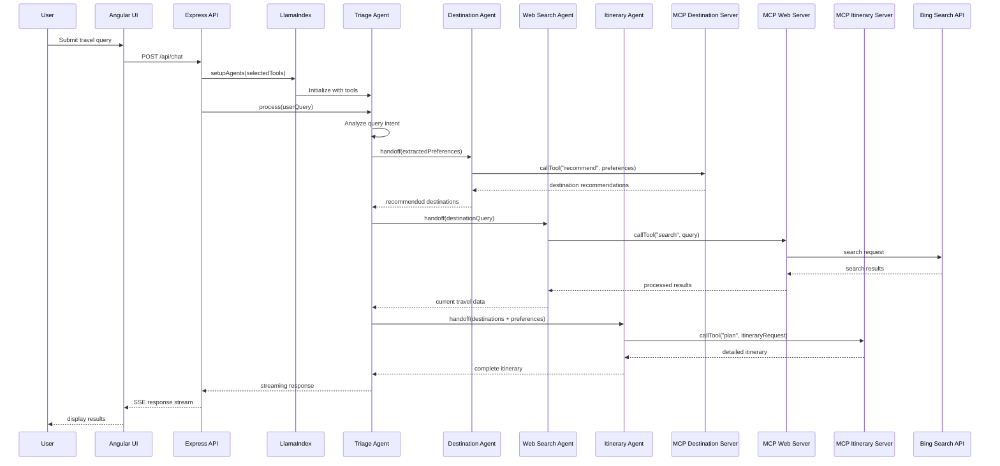
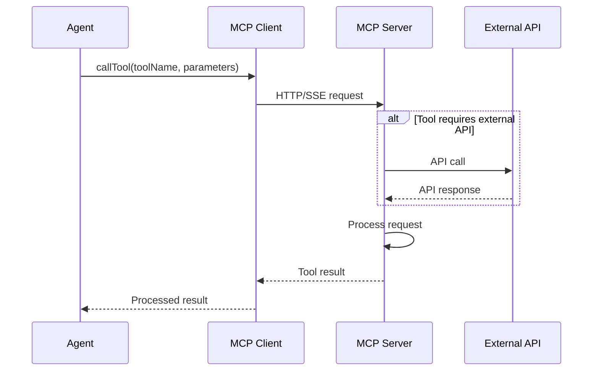
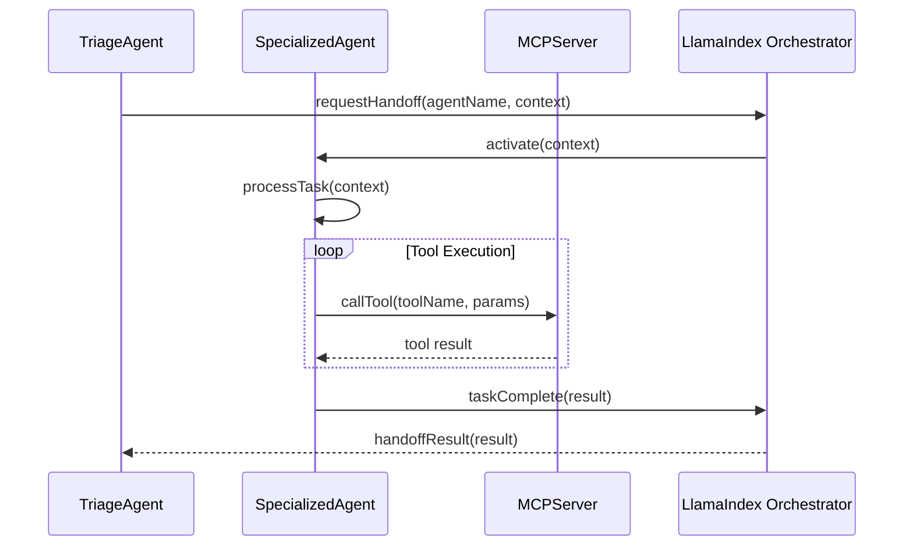
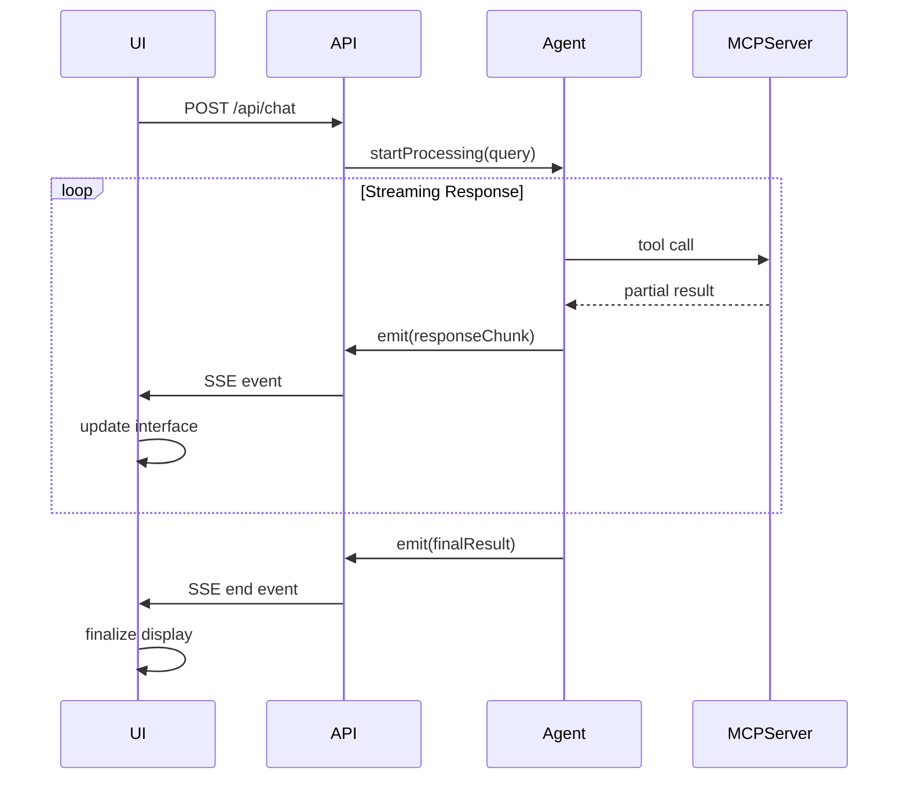

# Technical Architecture Documentation

## Table of Contents

1. [System Overview](#system-overview)
2. [Architecture Components](#architecture-components)
3. [Data Flow and Request Processing](#data-flow-and-request-processing)
4. [API Documentation](#api-documentation)
5. [MCP Server Architecture](#mcp-server-architecture)
6. [Agent Orchestration](#agent-orchestration)
7. [Sequence Diagrams](#sequence-diagrams)
8. [Deployment Architecture](#deployment-architecture)
9. [Development Guide](#development-guide)
10. [Extension and Customization](#extension-and-customization)

## System Overview

The Azure AI Travel Agents is a sophisticated microservices-based AI application that demonstrates how multiple AI agents can collaborate to handle complex travel-related queries. The system employs the Model Context Protocol (MCP) to enable seamless communication between different AI agents implemented in various programming languages.

### Key Design Principles

- **Microservices Architecture**: Each component is independently deployable and scalable
- **Multi-Agent Orchestration**: Specialized agents work together under a triage agent's coordination
- **Technology Diversity**: MCP servers implemented in TypeScript, C#, Java, and Python
- **Real-time Communication**: Server-Sent Events (SSE) for streaming responses
- **Observability**: Comprehensive monitoring through OpenTelemetry
- **Cloud-Native**: Designed for Azure Container Apps with Docker containerization

### System Capabilities

- **Natural Language Processing**: Understanding and extracting user preferences from conversational input
- **Intelligent Routing**: Triage agent determines which specialized agents to engage
- **Real-time Data Access**: Live web search integration for up-to-date travel information
- **Code Execution**: Dynamic code evaluation for complex logic and calculations
- **Local AI Inference**: On-demand model inference using ONNX and vLLM
- **Comprehensive Planning**: End-to-end itinerary creation and destination recommendations

## Architecture Components

### 1. Frontend Layer (Angular UI)

**Technology Stack:**
- Angular 19.2 with TypeScript
- RxJS for reactive programming
- Server-Sent Events for real-time communication
- Tailwind CSS for styling

**Key Responsibilities:**
- User interface for travel query input
- Real-time chat interface with streaming responses
- Tool selection and configuration
- Response visualization and formatting

**Core Services:**
- `ApiService`: Handles HTTP communication with backend
- `ChatService`: Manages conversation state and streaming
- Environment-based configuration for different deployment scenarios

### 2. API Layer (Express.js Server)

**Technology Stack:**
- Node.js 22.16+ with TypeScript
- Express.js 5.0 for HTTP server
- LlamaIndex.TS for agent orchestration
- OpenTelemetry for observability

**Key Responsibilities:**
- RESTful API endpoints
- Agent workflow orchestration
- MCP client management
- Response streaming via SSE
- Request routing and validation

**Core Modules:**
- `index.ts`: Main server setup and endpoint definitions
- `orchestrator/`: Agent workflow management
- `mcp/`: MCP client implementations
- `utils/`: Shared utilities and helpers

### 3. MCP Server Layer

The system includes seven specialized MCP servers, each serving a specific domain:

#### 3.1 Echo Ping Server (TypeScript/Node.js)
- **Purpose**: Testing and validation of MCP communication
- **Port**: 5007 (3000 internal)
- **Technology**: TypeScript, Express.js
- **Features**: OpenTelemetry integration, simple echo functionality

#### 3.2 Customer Query Server (C#/.NET)
- **Purpose**: Natural language processing of customer inquiries
- **Port**: 5001 (8080 internal)
- **Technology**: .NET, ASP.NET Core
- **Features**: Preference extraction, query understanding

#### 3.3 Destination Recommendation Server (Java)
- **Purpose**: Travel destination suggestions based on preferences
- **Port**: 5002 (8080 internal)
- **Technology**: Java, Spring Boot
- **Features**: Recommendation algorithms, preference matching

#### 3.4 Itinerary Planning Server (Python)
- **Purpose**: Detailed travel itinerary creation
- **Port**: 5003 (8000 internal)
- **Technology**: Python, FastAPI
- **Features**: Multi-day planning, activity scheduling

#### 3.5 Code Evaluation Server (Python)
- **Purpose**: Dynamic code execution and evaluation
- **Port**: 5004 (5000 internal)
- **Technology**: Python
- **Features**: Secure code execution, result processing

#### 3.6 Model Inference Server (Python)
- **Purpose**: Local LLM inference using ONNX/vLLM
- **Port**: 5005 (5000 internal)
- **Technology**: Python, ONNX Runtime, vLLM
- **Features**: GPU acceleration, model optimization

#### 3.7 Web Search Server (TypeScript)
- **Purpose**: Real-time web search for travel information
- **Port**: 5006 (5000 internal)
- **Technology**: TypeScript, Bing Search API
- **Features**: Grounding with Bing Search, travel data aggregation

### 4. Monitoring Layer (Aspire Dashboard)

**Technology Stack:**
- .NET Aspire Dashboard
- OpenTelemetry collectors
- OTLP exporters

**Key Features:**
- Distributed tracing across all services
- Metrics collection and visualization
- Structured logging aggregation
- Performance monitoring

## Data Flow and Request Processing

### High-Level Request Flow

```
User Input → Angular UI → API Server → LlamaIndex Orchestrator → Triage Agent → Specialized Agents → MCP Servers → External Services → Response Chain
```

### Detailed Request Processing

1. **User Input Capture**
   - User submits travel query through Angular interface
   - UI validates input and selected tools
   - Request formatted as JSON with message and tool selection

2. **API Request Handling**
   - Express server receives POST to `/api/chat`
   - Request validation and logging
   - Tool configuration loaded based on selection

3. **Agent Orchestration Setup**
   - LlamaIndex `setupAgents()` function called
   - Filtered tools used to configure available agents
   - Multi-agent workflow created with triage agent as root

4. **Triage Agent Processing**
   - Initial query analysis by root triage agent
   - Decision on which specialized agents to engage
   - Handoff coordination to appropriate agents

5. **Specialized Agent Execution**
   - Selected agents receive delegated tasks
   - Each agent calls relevant MCP tools
   - Parallel or sequential processing based on dependencies

6. **MCP Server Communication**
   - HTTP/SSE connections to relevant MCP servers
   - Tool-specific processing (search, recommendation, planning, etc.)
   - External API calls as needed (Bing Search, Azure OpenAI, etc.)

7. **Response Aggregation**
   - Results collected from all engaged agents
   - Response formatting and validation
   - Streaming response chunks sent to client

8. **Client Response Processing**
   - Real-time response streaming via SSE
   - Progressive UI updates
   - Final response compilation and display

## API Documentation

### Base URL
- Local Development: `http://localhost:4000/api`
- Docker Environment: `http://web-api:4000/api`

### Authentication
Currently, the API does not require authentication for local development. In production, implement appropriate authentication mechanisms.

### Endpoints

#### GET /health
**Purpose**: Health check endpoint for service monitoring

**Response:**
```json
{
  "status": "OK"
}
```

**Status Codes:**
- 200: Service is healthy
- 500: Service error

#### GET /tools
**Purpose**: Retrieve available MCP tools and their status

**Response:**
```json
{
  "tools": [
    {
      "id": "echo-ping",
      "name": "Echo Test",
      "url": "http://tool-echo-ping:3000/mcp",
      "type": "http",
      "reachable": true,
      "selected": false,
      "tools": [
        {
          "name": "echo",
          "description": "Echo back the input"
        }
      ]
    }
  ]
}
```

**Status Codes:**
- 200: Tools retrieved successfully
- 500: Error fetching tools

#### POST /chat
**Purpose**: Process travel queries with streaming responses

**Request Body:**
```json
{
  "message": "I want to plan a vacation to Japan for 7 days",
  "tools": [
    {
      "id": "destination-recommendation",
      "name": "Destination Recommendation",
      "selected": true
    },
    {
      "id": "itinerary-planning", 
      "name": "Itinerary Planning",
      "selected": true
    }
  ]
}
```

**Response**: Server-Sent Events stream

**Response Format:**
```
Content-Type: text/event-stream
Cache-Control: no-cache
Connection: keep-alive

{"type":"metadata","agent":"TriageAgent","event":"AgentSetup","data":{...}}

{"type":"metadata","agent":"DestinationRecommendationAgent","event":"AgentToolCall","data":{...}}

{"type":"metadata","agent":"ItineraryPlanningAgent","event":"AgentStream","data":{...}}
```

**SSE Event Types:**
- `AgentSetup`: Agent initialization
- `AgentInput`: Input received by agent
- `AgentOutput`: Final agent output
- `AgentStream`: Streaming response content
- `AgentStepEvent`: Processing step information
- `AgentToolCall`: Tool invocation
- `ToolResultsEvent`: Tool execution results
- `ToolCallsEvent`: Multiple tool calls

**Status Codes:**
- 200: Stream started successfully
- 400: Invalid request body
- 500: Processing error

### Error Handling

All API endpoints return consistent error responses:

```json
{
  "error": "Error message description",
  "code": "ERROR_CODE",
  "timestamp": "2024-01-01T00:00:00Z"
}
```

## MCP Server Architecture

### Model Context Protocol (MCP) Overview

MCP is a protocol that enables AI models to securely access external tools and data sources. In this system, each MCP server provides specialized capabilities to the AI agents.

### MCP Communication Patterns

#### HTTP-based MCP (echo-ping)
```typescript
// Client configuration
const mcpClient = new MCPHTTPClient(
  "llamaindex-http-client",
  "http://tool-echo-ping:3000/mcp",
  accessToken
);

// Tool invocation
const tools = await mcpClient.listTools();
const result = await mcpClient.callTool("echo", { input: "Hello" });
```

#### SSE-based MCP (all other servers)
```typescript
// Client configuration  
const mcpClient = new MCPSSEClient(
  "llamaindex-sse-client",
  "http://tool-web-search:5000/sse",
  accessToken
);

// Streaming tool invocation
const tools = await mcpClient.listTools();
const result = await mcpClient.callTool("search", { query: "hotels in Tokyo" });
```

### Tool Discovery and Registration

Each MCP server exposes its available tools through the `listTools()` method:

```json
{
  "tools": [
    {
      "name": "search_destinations", 
      "description": "Search for travel destinations based on preferences",
      "inputSchema": {
        "type": "object",
        "properties": {
          "preferences": {
            "type": "object",
            "properties": {
              "budget": {"type": "string"},
              "activities": {"type": "array"},
              "duration": {"type": "string"}
            }
          }
        }
      }
    }
  ]
}
```

### Error Handling in MCP Servers

MCP servers implement consistent error handling:

```json
{
  "error": {
    "code": "TOOL_ERROR",
    "message": "Tool execution failed",
    "details": {
      "toolName": "search_destinations",
      "input": {...},
      "stackTrace": "..."
    }
  }
}
```

## Agent Orchestration

### LlamaIndex.TS Multi-Agent Framework

The system uses LlamaIndex.TS's multi-agent framework to coordinate between specialized agents:

```typescript
// Agent creation
const travelAgent = agent({
  name: "TriageAgent",
  systemPrompt: "Acts as a triage agent to determine the best course of action for the user's query.",
  tools: [...toolsList],
  canHandoffTo: handoffTargets.map(target => target.getAgents().map(agent => agent.name)).flat(),
  llm,
  verbose
});

// Multi-agent workflow
return multiAgent({
  agents: agentsList,
  rootAgent: travelAgent,
  verbose
});
```

### Agent Specialization

#### Triage Agent
- **Role**: Central coordinator and decision maker
- **Responsibilities**: 
  - Query analysis and intent understanding
  - Agent selection and task delegation
  - Response coordination and quality control
- **Tools**: Access to all available tools for comprehensive analysis

#### Customer Query Agent
- **Role**: Natural language processing specialist
- **Responsibilities**:
  - Extract preferences from conversational input
  - Normalize and structure customer requirements
  - Handle ambiguous or incomplete requests
- **Tools**: NLP processing, preference extraction

#### Destination Recommendation Agent
- **Role**: Travel destination expert
- **Responsibilities**:
  - Analyze user preferences for destination matching
  - Provide ranked destination recommendations
  - Consider factors like budget, season, activities
- **Tools**: Destination database, recommendation algorithms

#### Itinerary Planning Agent
- **Role**: Trip planning specialist  
- **Responsibilities**:
  - Create detailed day-by-day itineraries
  - Optimize routes and timing
  - Handle logistics and scheduling
- **Tools**: Itinerary algorithms, scheduling optimization

#### Web Search Agent
- **Role**: Real-time information gatherer
- **Responsibilities**:
  - Search for current travel information
  - Validate recommendations with live data
  - Provide up-to-date pricing and availability
- **Tools**: Bing Search API, data aggregation

#### Code Evaluation Agent
- **Role**: Dynamic computation specialist
- **Responsibilities**:
  - Execute custom logic and calculations
  - Handle complex data processing
  - Provide algorithmic solutions
- **Tools**: Python code execution, mathematical computation

#### Model Inference Agent
- **Role**: Local AI processing
- **Responsibilities**:
  - Provide specialized model inference
  - Handle GPU-accelerated computations
  - Support custom model deployments
- **Tools**: ONNX runtime, vLLM, GPU acceleration

### Agent Handoff Patterns

```typescript
// Explicit handoff
if (needsDestinationRecommendation) {
  return handoff("DestinationRecommendationAgent", {
    preferences: extractedPreferences,
    context: conversationContext
  });
}

// Parallel execution
const [recommendations, currentData] = await Promise.all([
  callAgent("DestinationRecommendationAgent", preferences),
  callAgent("WebSearchAgent", { query: "current travel conditions" })
]);

// Sequential handoff chain
const preferences = await callAgent("CustomerQueryAgent", userInput);
const destinations = await callAgent("DestinationRecommendationAgent", preferences);
const itinerary = await callAgent("ItineraryPlanningAgent", { 
  destinations, 
  preferences 
});
```

## Sequence Diagrams

### Complete User Query Processing



### MCP Tool Invocation



### Agent Handoff Process



### Real-time Streaming Response



## Deployment Architecture

### Local Development Environment

```
┌─────────────────────────────────────────────────────────────────┐
│                     Local Development                           │
├─────────────────────────────────────────────────────────────────┤
│  ┌─────────────┐  ┌─────────────┐  ┌─────────────────────────┐  │
│  │ Angular UI  │  │ Express API │  │     MCP Servers         │  │
│  │ Port: 4200  │  │ Port: 4000  │  │ Ports: 5001-5007       │  │
│  └─────────────┘  └─────────────┘  └─────────────────────────┘  │
│         │                │                       │             │
│         └────────────────┼───────────────────────┘             │
│                          │                                     │
│  ┌─────────────────────────────────────────────────────────────┤
│  │            Aspire Dashboard (Port: 18888)                   │
│  └─────────────────────────────────────────────────────────────┘
└─────────────────────────────────────────────────────────────────┘
```

### Docker Compose Environment

```yaml
# High-level service dependencies
services:
  aspire-dashboard:     # Monitoring foundation
  tool-*:              # 7 MCP servers (ports 5001-5007)
  web-api:             # Express API (port 4000)
    depends_on: tool-*
  web-ui:              # Angular UI (port 4200) 
    depends_on: web-api
```

### Azure Container Apps Deployment

```
┌─────────────────────────────────────────────────────────────────┐
│                    Azure Container Apps Environment             │
├─────────────────────────────────────────────────────────────────┤
│  ┌─────────────┐  ┌─────────────┐  ┌─────────────────────────┐  │
│  │   UI App    │  │   API App   │  │     MCP Tool Apps       │  │
│  │             │  │             │  │   (7 separate apps)     │  │
│  │ ┌─────────┐ │  │ ┌─────────┐ │  │ ┌─────────┬─────────┐   │  │
│  │ │Container│ │  │ │Container│ │  │ │Container│Container│   │  │
│  │ └─────────┘ │  │ └─────────┘ │  │ └─────────┴─────────┘   │  │
│  └─────────────┘  └─────────────┘  └─────────────────────────┘  │
├─────────────────────────────────────────────────────────────────┤
│                     Azure Services                             │
│  ┌─────────────┐  ┌─────────────┐  ┌─────────────────────────┐  │
│  │ OpenAI      │  │ Monitor     │  │ Container Registry      │  │
│  │ Service     │  │ (Logs/      │  │                         │  │
│  │             │  │ Metrics)    │  │                         │  │
│  └─────────────┘  └─────────────┘  └─────────────────────────┘  │
└─────────────────────────────────────────────────────────────────┘
```

### Environment Configuration

#### Local Development (.env)
```bash
# API Configuration
PORT=4000
NODE_ENV=development

# MCP Server URLs (local)
MCP_ECHO_PING_URL=http://localhost:5007
MCP_CUSTOMER_QUERY_URL=http://localhost:5001
MCP_WEB_SEARCH_URL=http://localhost:5006
MCP_ITINERARY_PLANNING_URL=http://localhost:5003
MCP_MODEL_INFERENCE_URL=http://localhost:5005
MCP_CODE_EVALUATION_URL=http://localhost:5004
MCP_DESTINATION_RECOMMENDATION_URL=http://localhost:5002

# Azure Services
AZURE_OPENAI_ENDPOINT=...
AZURE_OPENAI_API_KEY=...
BING_SEARCH_API_KEY=...

# Monitoring
OTEL_EXPORTER_OTLP_ENDPOINT=http://localhost:18889
```

#### Docker Environment (.env.docker)
```bash
# MCP Server URLs (Docker internal)
MCP_ECHO_PING_URL=http://tool-echo-ping:3000
MCP_CUSTOMER_QUERY_URL=http://tool-customer-query:8080
MCP_WEB_SEARCH_URL=http://tool-web-search:5000
MCP_ITINERARY_PLANNING_URL=http://tool-itinerary-planning:8000
MCP_MODEL_INFERENCE_URL=http://tool-model-inference:5000
MCP_CODE_EVALUATION_URL=http://tool-code-evaluation:5000
MCP_DESTINATION_RECOMMENDATION_URL=http://tool-destination-recommendation:8080

# Docker-specific settings
IS_LOCAL_DOCKER_ENV=true
OTEL_EXPORTER_OTLP_ENDPOINT=http://aspire-dashboard:18889
```

#### Azure Production
- Environment variables managed through Azure Container Apps configuration
- Secrets stored in Azure Key Vault
- Automatic service discovery within Container Apps environment
- Managed identity for Azure service authentication

### Scaling Considerations

#### Horizontal Scaling
- Each MCP server can be scaled independently
- API server supports multiple instances with load balancing
- UI served through CDN in production
- Database-less architecture simplifies scaling

#### Resource Requirements
- **UI**: Minimal resources (static serving)
- **API**: CPU-intensive for agent orchestration
- **MCP Servers**: Varies by function
  - Code evaluation: High CPU/memory
  - Model inference: GPU requirements
  - Web search: Network-intensive
  - Others: Moderate resource usage

#### Performance Optimization
- Connection pooling for MCP clients
- Response caching where appropriate
- Streaming responses to reduce perceived latency
- Parallel agent execution for independent tasks

## Development Guide

### Prerequisites

**Required Software:**
- Node.js 22.16+ 
- Docker Desktop
- Git
- Azure CLI (for deployment)
- PowerShell 7+ (Windows only)

**Development Tools:**
- VS Code (recommended)
- Dev Containers extension
- Azure Developer CLI (azd)

### Local Development Setup

1. **Clone Repository**
   ```bash
   git clone https://github.com/Azure-Samples/azure-ai-travel-agents.git
   cd azure-ai-travel-agents
   ```

2. **Azure Authentication**
   ```bash
   azd auth login
   ```

3. **Provision Azure Resources**
   ```bash
   azd provision
   ```

4. **Start Services**
   ```bash
   # Terminal 1: Start API
   npm start --prefix=src/api
   
   # Terminal 2: Start UI  
   npm start --prefix=src/ui
   ```

5. **Access Applications**
   - UI: http://localhost:4200
   - API: http://localhost:4000
   - Aspire Dashboard: http://localhost:18888

### Docker Development

1. **Build and Start All Services**
   ```bash
   cd src
   docker-compose up --build
   ```

2. **Individual Service Development**
   ```bash
   # Start specific services
   docker-compose up aspire-dashboard tool-echo-ping web-api
   
   # View logs
   docker-compose logs -f web-api
   
   # Rebuild specific service
   docker-compose build web-api
   ```

### Testing Strategy

#### Unit Testing
```bash
# API tests
cd src/api
npm test

# UI tests  
cd src/ui
npm test
```

#### Integration Testing
```bash
# Test MCP server connectivity
curl http://localhost:5007/health

# Test API endpoints
curl http://localhost:4000/api/health
curl http://localhost:4000/api/tools
```

#### End-to-End Testing
```bash
# Use provided test queries
curl -X POST http://localhost:4000/api/chat \
  -H "Content-Type: application/json" \
  -d '{"message":"Plan a 3-day trip to Tokyo","tools":[...]}'
```

### Debugging

#### API Server Debugging
```bash
# Enable debug logging
DEBUG=true npm start --prefix=src/api

# VS Code debugging
# Use launch.json configuration for step debugging
```

#### MCP Server Debugging
```bash
# Check MCP server logs
docker-compose logs tool-echo-ping

# Test MCP connectivity directly
node -e "
const { MCPHTTPClient } = require('./src/api/src/mcp/mcp-http-client.js');
const client = new MCPHTTPClient('test', 'http://localhost:5007/mcp');
client.connect().then(() => console.log('Connected'));
"
```

#### UI Debugging
```bash
# Development server with source maps
npm start --prefix=src/ui

# Browser DevTools
# Use Angular DevTools extension for component inspection
```

### Code Quality

#### Linting and Formatting
```bash
# API
cd src/api
npm run lint
npm run format

# UI
cd src/ui  
npm run lint
npm run format
```

#### Type Checking
```bash
# API
cd src/api
npx tsc --noEmit

# UI
cd src/ui
npx ng build --configuration development
```

## Extension and Customization

### Adding New MCP Servers

1. **Create Server Directory**
   ```bash
   mkdir src/tools/my-new-tool
   cd src/tools/my-new-tool
   ```

2. **Implement MCP Server**
   ```typescript
   // For TypeScript implementation
   import { McpServer } from '@modelcontextprotocol/sdk/server/index.js';
   
   const server = new McpServer({
     name: "my-new-tool",
     version: "1.0.0"
   });
   
   server.setRequestHandler(ListToolsRequestSchema, async () => {
     return {
       tools: [
         {
           name: "my_tool",
           description: "Description of my tool",
           inputSchema: {
             type: "object",
             properties: {
               input: { type: "string" }
             }
           }
         }
       ]
     };
   });
   ```

3. **Add Docker Configuration**
   ```dockerfile
   FROM node:22-alpine
   WORKDIR /app
   COPY package*.json ./
   RUN npm install
   COPY . .
   EXPOSE 3000
   CMD ["npm", "start"]
   ```

4. **Update Docker Compose**
   ```yaml
   tool-my-new-tool:
     container_name: tool-my-new-tool
     build: ./tools/my-new-tool
     ports:
       - "5008:3000"
   ```

5. **Register in API**
   ```typescript
   // src/api/src/orchestrator/llamaindex/tools/index.ts
   export type McpServerName = 
     | "echo-ping"
     | "my-new-tool";  // Add new tool
   
   export const McpToolsConfig = () => ({
     "my-new-tool": {
       config: {
         url: process.env["MCP_MY_NEW_TOOL_URL"] + MCP_API_HTTP_PATH,
         type: "http",
         verbose: true,
       },
       id: "my-new-tool",
       name: "My New Tool",
     },
     // ... other tools
   });
   ```

6. **Create Agent Integration**
   ```typescript
   // src/api/src/orchestrator/llamaindex/index.ts
   if (tools["my-new-tool"]) {
     const mcpServerConfig = mcpToolsConfig["my-new-tool"];
     const tools = await mcp(mcpServerConfig.config).tools();
     const myNewAgent = agent({
       name: "MyNewAgent",
       systemPrompt: "Specialized agent for my new functionality",
       tools,
       llm,
       verbose,
     });
     agentsList.push(myNewAgent);
     handoffTargets.push(myNewAgent);
     toolsList.push(...tools);
   }
   ```

### Customizing Agent Behavior

#### Modifying System Prompts
```typescript
const customAgent = agent({
  name: "CustomTravelAgent",
  systemPrompt: `
    You are a specialized travel agent focusing on luxury experiences.
    Always consider premium options and personalized service.
    Use formal language and provide detailed explanations.
  `,
  tools,
  llm,
  verbose,
});
```

#### Adding Custom Tools to Agents
```typescript
import { FunctionTool } from "llamaindex";

const customTool = FunctionTool.from(
  async ({ query }: { query: string }) => {
    // Custom tool implementation
    return { result: "Custom processing result" };
  },
  {
    name: "custom_processor",
    description: "Custom processing tool",
    parameters: {
      type: "object",
      properties: {
        query: { type: "string", description: "Input query" }
      }
    }
  }
);

const agentWithCustomTool = agent({
  name: "EnhancedAgent",
  systemPrompt: "Agent with custom capabilities",
  tools: [...mcpTools, customTool],
  llm,
  verbose,
});
```

### UI Customization

#### Adding New Tool Selection
```typescript
// src/ui/src/app/services/api.service.ts
export type ServerID =
  | 'echo-ping'
  | 'customer-query' 
  | 'my-new-tool';  // Add new tool type
```

#### Custom Response Components
```typescript
// Create new component for specialized responses
@Component({
  selector: 'app-custom-response',
  template: `
    <div class="custom-response">
      <h3>{{response.title}}</h3>
      <div [innerHTML]="formatResponse(response.content)"></div>
    </div>
  `
})
export class CustomResponseComponent {
  @Input() response: any;
  
  formatResponse(content: string): string {
    // Custom response formatting
    return content;
  }
}
```

### Monitoring and Observability

#### Custom Metrics
```typescript
import { metrics } from '@opentelemetry/api';

const meter = metrics.getMeter('my-custom-metrics');
const requestCounter = meter.createCounter('custom_requests_total');

// In your service
requestCounter.add(1, { 
  operation: 'custom_operation',
  status: 'success' 
});
```

#### Custom Traces
```typescript
import { trace } from '@opentelemetry/api';

const tracer = trace.getTracer('my-custom-tracer');

async function customOperation() {
  const span = tracer.startSpan('custom_operation');
  try {
    // Your operation here
    span.setStatus({ code: SpanStatusCode.OK });
  } catch (error) {
    span.setStatus({ 
      code: SpanStatusCode.ERROR, 
      message: error.message 
    });
    throw error;
  } finally {
    span.end();
  }
}
```

### Deployment Customization

#### Custom Azure Resources
```bicep
// infra/custom-resources.bicep
param location string
param environmentName string

resource customService 'Microsoft.App/containerApps@2023-05-01' = {
  name: 'my-custom-service'
  location: location
  properties: {
    environmentId: containerAppsEnvironment.id
    configuration: {
      ingress: {
        external: true
        targetPort: 3000
      }
    }
    template: {
      containers: [
        {
          name: 'my-custom-service'
          image: 'my-custom-service:latest'
          resources: {
            cpu: '0.5'
            memory: '1Gi'
          }
        }
      ]
    }
  }
}
```

#### Environment-Specific Configuration
```yaml
# azure.yaml - Add custom service
services:
  my-custom-service:
    language: typescript
    host: containerapp
    docker:
      path: ./src/tools/my-new-tool/Dockerfile
      context: ./src/tools/my-new-tool
```

This comprehensive documentation provides architects and developers with the detailed technical understanding needed to work with, extend, and deploy the Azure AI Travel Agents system effectively.